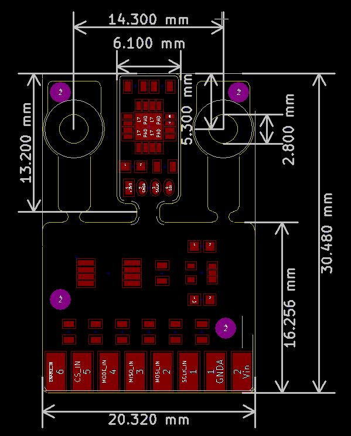
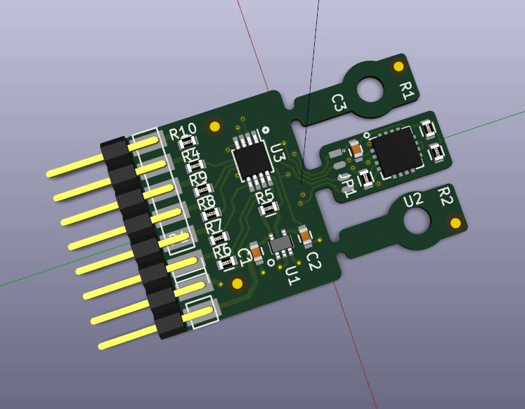
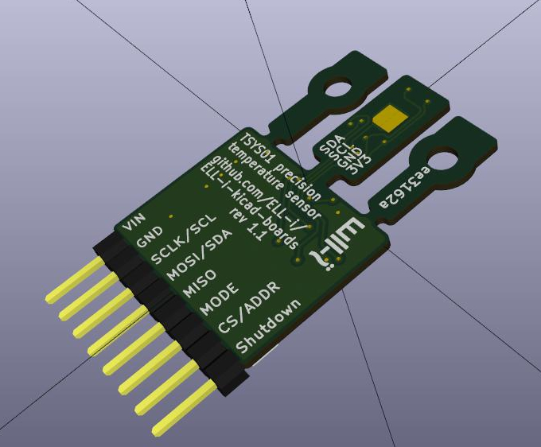

# TSYS01 Temperature Sensor Board
Temperature sensor board built around TSYS01, complete with an Arduino driver.

This temperature sensor board provides very high accuracy(± 0.1°C) and resolution(± 0.01°C) temperature sensing using the TSYS01 digital single chip temperature sensor.
The board enables user selectable digital communication with the TSYS01 temperature sensor with either I2C or SPI on any 3.3V compatible microcontroller.
TSYS01 includes a 24 bit ADC at the temperature sensor, which enables very low noise conversion results when compared to most ADCs embedded in a microcontroller. 
The sensor board also provides limited overvoltage, reverse voltage and ESD protection for TSYS01 in all of the I/O pins.
This will make accidentally breaking the temperature sensor board unlikely in prototyping applications.

Every TSYS01 chip provides factory calibrated coefficients for converting the ADC values to temperature(°C).
The temperature sensor board provides the peripherals and connectors required for using the TSYS01 temperature sensor chip without the need for SMD soldering.
It also includes a dedicated linear regulator with low drop out voltage and good ripple rejection for providing accurate power to the temperature sensor.
This makes it much easier to actualise the promised accuracy of ± 0.1°C with this temperature sensor board than with any analog temperature sensor.

The TSYS01 has been designed for low power, low time constant and low self heating.
The regulator of the sensor board can also be turned off to reduce the idle power consumption of the board.
This makes the TSYS01 temperature sensor board a good option for obtaining accurate temperature measurements in applications where low power consumption is required. 

There is also an Arduino library available for this temperature sensor board enabling fast and easy deployment on the Arduino platform.
The library can be used to communicate with multiple temperature sensors using the I2C or SPI interface.
It also calculates temperature values using the calibration coefficients read from the TSYS01 and provides functions for turning on and off the linear regulator of the sensor board.

The board is 20.5 mm wide, 30.5 mm long (39 mm including connector pins) and 2.5 mm thick. There are 2 mounting holes for M2.5 screws on top left and right. The board has exposed pad under TSYS01. If you're sensing some material, pad should be connected to material being sensed with electrically insulating and thermally conductive tape. If you're sensing air temperature, pad should not be connected. 

#User instructions

##Caution
Handle with care.

Do not submerge in water.

Do not use outside the specified temperature range of -40C to 125C.

Make sure to protect the device from water condensation when used in low temperature and high air moisture environments.

##Usage

Connect Vin in to a voltage source(3.3V-12V) and GND to 0V.

Connect data signal lines for I2C or SPI communication and connect MODE pin to 0V when using SPI, or leave it unconnected for I2C.

You can also optionally connect Shutdown to a microcontroller data pin to turn off the sensor board while it is not in use.

When using I2C you can connect the CS/ADDR pin to ground to change the sensor I2C address.

When you have connected all of the data lines you need, you can communicate with the TSYS01 chip using the communication method you chose to wire. You can use the provided Arduino library to easily communicate with your sensor, or choose to implement the communication yourself using the TSYS01 datasheet for help and the Arduino library as an example.

The provided Arduino library can be downloaded from https://github.com/Ell-i/ELL-i-KiCAD-Boards.
The Arduino library can be found under TSYS01/Arduino.(You need Tsys01.h and Tsys01.cpp)
You can also find an example test program under the examples folder.
With the newest Arduino IDE(as of writing version 1.6.7), you only need to place the Tsys01.h and Tsys01.cpp files to to same folder with your sketch to use the library.

With the Arduino library you are supposed to create a new Tsys01 object for each TSYS01 temperature sensor you are using and give the pin numbers required as parameters in the constructor.
There is also a constructor without any parameters, but this should only be used to create global variables that are to be reinitialized by using a constructor with parameters.
The Tsys01 object created with the parameterless construct will not work(!!!), because the function can not know which Arduino pins you have attached to the sensor, and which communication protocol you want to use.
The object constructor automatically loads the calibration parameters from the sensor and saves them for further use.

To read a temperature value from the sensor you first need to call the startAcd method of the Tsys01 object to start the analog to digital conversion.
The function will block the other code from running until the adc start command has been sent, but returns before the conversion result is ready.
This enables you to run some code while the conversion is still taking place, or you can just use a delay to wait for the conversion to finish.
According to the TSYS01 datasheet the conversion takes a maximum of 9.04 ms, but you can wait 10 ms with delay(10) to be sure.
After the conversion is ready you should be able to read the temperature by using the readTemperature() method of the Tsys01 object.
The method reads the ADC result from the sensor, uses the calibration parameters to calculate the temperature value and returns the result in degrees celsius.
To get a new temperature value you must start a new conversion, wait for the conversion to finish and then use the readTemperature() method again.

If you have connected the Shutdown pin of the temperature sensor, you can use the powerOff() and powerOn() methods to turn off and on the regulator of the board.
After turning the regulator back on with the powerOn() method, you should be sure to wait 4 ms before starting another adc conversion to give the sensor enough time to reset.
To minimize the power consumption you should also make sure that all of the signal pins that you have connected to the sensor board are pulled down to prevent the TSYS01 sensor from drawing power through the signal lines.
For further power reductions in applications where it is absolutely necessary to reduce the power consumption even more, you could refer to the hacking section.

##Hacking

To reduce the power consumption of the TSYS01 Temperature Sensor Board when the regulator has been turned off you could remove the pull-up resistor R5 from the board. This will require you to connect the Shutdown pin to prevent the input pin from floating. Removing the 100k pull-up resistor should reduce the current drawn by the sensor board by Vin/100000 amperes, when the regulator has been turned off.

To reduce the size of the temperature sensor board where small size is essential, and use the sensor board as a simple breakout board, you can cut off the sensor island from the main board. This will remove the regulator, SPI communication option, and all of the input protection permanently(!!!) from the board. You will also have to provide the noise free input power to sensor at 3.3V to get the advertised accuracy of 0.1°C and lowest possible noise. However, you should be able to solder a pin header to the 4 available pads at the sensor island for communicating with the sensor using I2C.

###Pin layout

The pin layout is visible from the image above.
The names of the pins and their functions are described in the following list:

 - Vin - For connecting input power. (3.3V - 12V, 5V preferred)
 - GND - For connecting the ground wire.
 - SCLK/SCL - For connecting the clock signal when using SPI or I2C communication.
 - MOSI/SDA - Connect MOSI when using SPI and SDA when using I2C.
 - MISO - Connect MISO when using SPI.
 - MODE - Select communication protocol. Has internal pull-up so defaults to I2C. (LOW for SPI, High for I2C)
 - CS/ADDR - Chip select when using SPI. I2C address selector pin when using I2C. Has internal pull-up so defaults to 1110110x. (HIGH for addr 1110110x, LOW for addr 1110111x)
 - Shutdown - Pin for shutting down onboard regulator. Has internal pull-up so defaults to enable regulator. (LOW for disable regulator, HIGH for enable regulator)

###Voltages

Logic level voltage range 0-3.3V

Input power voltage range(Vin to GND) 3.3V-12V(20V abs max!)

##Troubleshooting

If you are using the provided Arduino library to communicate with the TSYS01, you can enable additional debug prints from inside the library by changing: #define TSYS_DEBUG 0 to #define TSYS_DEBUG 1 in the beginning of the Tsys01.cpp -file.
This will enable additional debug prints from inside the library and should help in localizing the problem.
Enabling the debug prints should reveal whether the program performs all the steps required for successfully getting a temperature value.
These steps are: The reset signal should be sent to the microcontroller after the power has been applied.
You should wait 4 ms before sending additional commands to the sensor after reset.
The calibration parameters should be read from the TSYS01 sensor.
The ADC start command should be sent to the TSYS01 sensor and 10 ms should pass after sending the read temperature command to the sensor.
The read command should return something else than all zeroes for the ADC value.

If all zeroes is being returned for the calibration parameters there is most likely something wrong with you wiring of the TSYS01 sensor, and you should: 

 - Make sure that the sensor has been connected correctly to the microcontroller by referring to the pin layout provided in this document for the TSYS01 temperature sensor board and the pin out of your microcontroller.

 - If you have checked the connections and are still having problems with receiving zeroes for the calibration parameters, you should use an oscilloscope to verify that the waveforms of your communication signals are nice and square and without excessive noise.

If the debug print indicates that the ADC value received from the sensor is zero for all bytes, you should check the following:

 - Check that you have implemented the proper 10 ms delay between calling the startADC() and readTemperature() functions. And make sure that the startADC() function is called once for each call of the readTemperature function. Multiple calls to the readTemperature() function will result in all zeros being returned by the TSYS01 sensor.

 - If using the powerOn() and powerOff() functions, make sure that you have implemented a 4 ms delay before trying to start a new ADC conversion. The 4 ms delay is needed for the TSYS01 to complete the reset initiated by the powerOn() -function.

 - You can try running the test program provided under Arduino/examples/tsys01 by using the connections indicated in the comments of that file. If this works the problem is most likely in the software you are trying to use. You should compare your software to the working example ( [video](https://www.youtube.com/watch?v=D7fiz2vnEho) ) to verify that you're using the provided library correctly.

If you are still having problems you can email support@ell-i.org 

It will help if you can describe your problem, setup and the steps you have taken when trying to solve the issue in you email.

##How to buy
The board is available from [Elecrow's web store](http://www.elecrow.com/tsys01-temperature-sensor-board.html).

